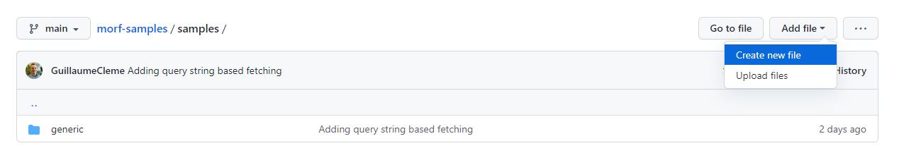
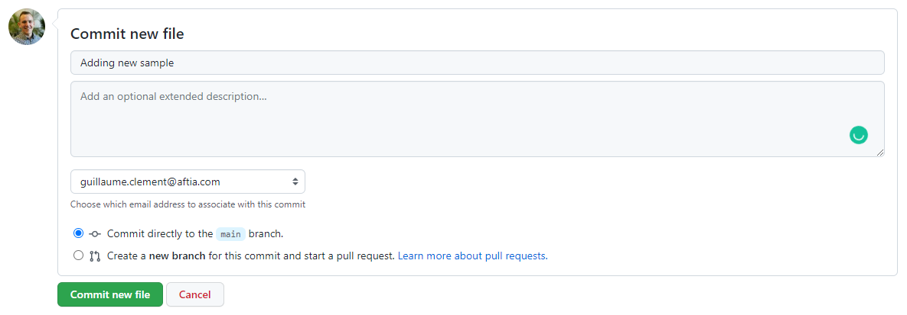

# MORF Preview

A repository containing sample MORF forms used for demonstration purposes. Generic industry specific samples can be found under the `/demos` folder along with presentation instructions.

## Add a sample

1. To add a new sample, start by heading over to http://editor.getmorf.io/ to create a new Morf form
2. Copy the generated Morf definition (JSON)
3. Browse the code in this repository to add a new Morf definition under the `./samples` folder: https://github.com/aftialabs/morf-samples/tree/main/samples
4. Use the **Add file** option to create a new file.
    
5. Give the file a name and copy the Morf definition (JSON) contents to the file.
6. Add a commit message and commit the file directly to `main` or use a pull request if you do not have write access to the repository
    
7. Navigate to https://preview.getmorf.io/ by adding a `?form=` query string parameter specifying the path of the new file created (e.g. `https://preview.getmorf.io/?form=/samples/generic/basic-enrollment.json`)

## Contributing

To contribute to this repository, submit a new pull request containing new or existing sample updates, documentation, and related assets. Place samples within the existing taxonomy and ensure that the naming convention is respected.

## Disclaimer

Morf is an AFTIA Solutions trademark. 

All samples included in this repository are used for demonstration purposes and in no way do they signify brand affiliation. 
